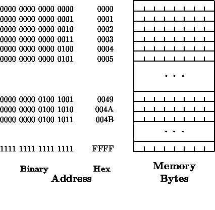
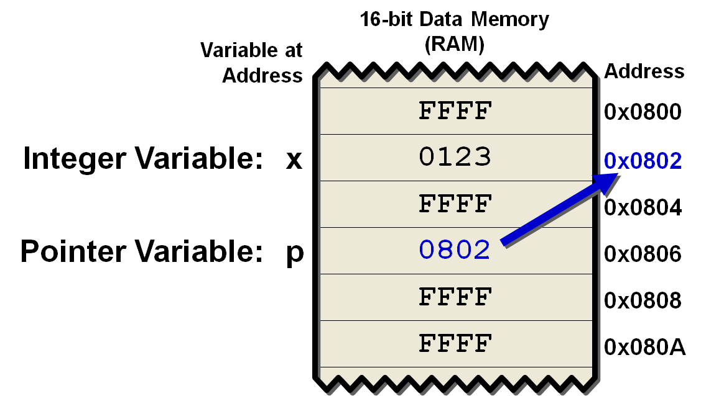
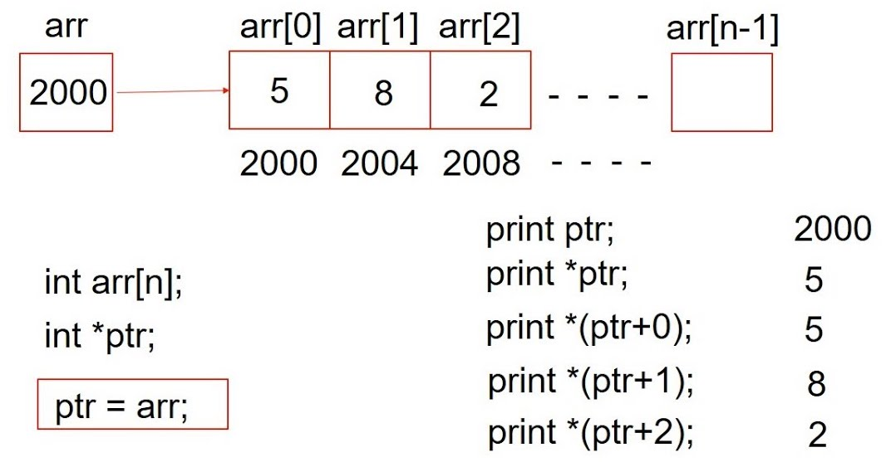

# C Pointers

## Table of Contents
1. [Goals](#goals)
2. [Memory](#memory)
    1. [C Objects](#c-objects)
    2. [Pointers and Addresses](#pointers-and-addresses)
    3. [Function Arguments](#function-arguments)
    4. [Arrays](#arrays)
    5. [Address and Pointer Arithmetic](#address-and-pointer-arithmetic)
    6. [Character Pointers](#character-pointers)
3. [Command-line Arguments](#command-line-arguments)

## Goals <a name="goals"></a>
A pointer is a variable that **contains the address of a variable**.
To understand pointers, we must first have a good mental picture of
how **memory** is organized, which also requires us to start to get familiar with *hardware*.
At a high level,
every C program runs on an **abstract machine**,
which defines what a C program does;
but ultimately, a C program runs on hardware,
and the hardware determines what behavior we actually see.
Mapping abstract machine behavior 
to *instructions* on real hardware is the task of the C **compiler** 
(and the standard library and operating system). 
A C compiler is correct if and only if 
*it translates each correct program to instructions
that simulate the expected behavior of the abstract machine*.

## Memory <a name="memory"></a>
Generally speaking,
memory is a *modifiable array* of 2<sup>W</sup> bytes 
(recall that a byte is 8 bits that can represent a number between 0 and 255, inclusive).
You can think of each byte in memory as a *memory cell*.
These memory cells are *consecutively* **addressed**
and may be manipulated *individually or in contiguous groups*.



For any number *a* between 0 and 2<sup>W</sup>-1, we can
**write** a byte at **address** *a*,
or **read** the byte at address *a* to obtain the most-recently-written value
at that address.
Since every memory address corresponds to a byte, 
we call memory in the case **byte-addressable memory**.

The C abstract machine 
refers to values of many types, 
some of which do not fit in a single byte.
The compiler, hardware, and standard together 
define how *C objects* map to bytes. 
Each object uses *a contiguous range of addresses* (and thus bytes).
> For example, a `char` object is one byte, and it can "live" in any individual 
> one-byte memory cell in memory. A `short` object is typically two bytes,
> and it can "live" in a pair of adjacent one-byte memory cells.

The C standard is pretty transparent about how objects are stored. 
A C program can ask how big an object is using the `sizeof` keyword. 
`sizeof(T)` returns the number of *bytes* 
in the representation of an object of type `T`, 
and `sizeof(x)` returns the size of object `x`. 
The result of `sizeof` is a value of type `size_t`, 
which is an *unsigned integer type* large enough to hold 
any representable size
(`size_t` is defined in the header `<stddef.h>`).

:question: **What's the relationship between `size_t` and _W_, the size of the address space?**
<details>
<summary>Answer</summary>

`size_t` must be able to store the maximum size 
of a theoretically possible array or object. 
In other words, the number of bits in `size_t` is equal to 
*the number of bits required to store the maximum address in the machine's memory*. 
For example, on a 32-bit system, `size_t` occupies 32 bits, on a 64-bit system — 64 bits.
</details>

<details>
<summary>:heavy_plus_sign: Good To Know</summary>

Objects also have **alignment**. 
This restricts where they can be stored in memory. 
For instance, on x86-64 machines, `int` has alignment 4. 
This means that the address of any `int` in the program is always a multiple of 4. 
You can query the alignment of a type or object using the `__alignof__` keyword. 
*An object's size is always a multiple of its alignment*.

Alignment restrictions can make hardware simpler, and therefore faster.
The compiler, library, and operating system all work together to enforce alignment restrictions. 
In abstract machine terms, accessing data through an unaligned pointer causes undefined behavior. 
<!-- Note that undefined behavior occurs even though x86-64 hardware has optional alignment: the hardware is capable of dereferencing an unaligned pointer. -->

</details>

### C Objects <a name="c-objects"></a>
C is *not* an object-oriented programming language,
but the concept of an object still exists in C.
<!-- albeit different from that in Java. -->
An object is **a region of memory that contains a value**, 
such as the integer 5.
More specifically, 
it is "a region of data storage in the execution environment, 
the contents of which can represent values".
For example,
```c
int global = 1;
int foo(void) {
    int local;
    int *ptr;

    local = global + 1;
    ptr = (int *) malloc(sizeof(int));
    *ptr = local;
    return 0;
}
```
We have four objects:
- An `int` global object called `global`;
- An `int` local object called `local`;
- An `int` pointer (we will discuss pointers [next](#pointers-and-addresses)) object called `ptr`;
- An *anonymous memory region* allocated by [`malloc`](https://pubs.opengroup.org/onlinepubs/007904975/functions/malloc.html) and accessed by `*ptr`;

Objects *never overlap*: 
the C abstract machine requires that each of these objects occupies *distinct memory*.

<details>
<summary>:heavy_plus_sign: Good To Know</summary>

Each object has a **lifetime**, 
which is called **storage duration** by the standard. 
There are three different kinds of lifetime:
* **static** lifetime: The object lasts as long as the program runs (e.g., `global`).
* **automatic** lifetime: The compiler allocates and destroys the object automatically (e.g., `local`, `ptr`).
* **dynamic** lifetime: The programmer allocates and destroys the object explicitly (e.g., `*ptr`).

What happens when an object is *uninitialized*? The answer depends on its lifetime.
We have in fact discussed this in a previous [module](../c-functions/notes.md#initialization).
Let's reiterate here based on lifetime:
* static lifetime: The object is initialized to 0.
* automatic or dynamic lifetime: The object is *uninitialized* and 
reading the object's value before it is assigned causes [**undefined behavior**](https://en.wikipedia.org/wiki/Undefined_behavior).

Objects with dynamic lifetime are difficult to use correctly. 
Dynamic lifetime causes many serious problems in C programs, 
including *memory leaks*, *use-after-free*, *double-free*, and so forth. 
Those serious problems cause *undefined behavior*.
However, dynamic lifetime is critically important. 
*Only with dynamic lifetime can you construct an object 
whose size is unknown at compile time
or construct an object that outlives its creating function*.
</details>

An object can have many names.
In the example below, `local` and `*ptr` refer to the same object:
```c
int bar(void) {
    int local = 1;
    int *ptr = &local;
}
```
The different names for an object are sometimes called **aliases**.
We will learn the `*` and `&` operators in the next section.

### Pointers and Addresses <a name="pointers-and-addresses"></a>
A **pointer** is an object that occupies a consecutive group of memory cells
that hold an **address**.



In the figure above,
`x` is an integer variable,
and `p` is a pointer that points to it
(i.e., `p` holds the address of `x`).

The unary operator `&` *gives the address of an object*, so the statement:
```c
p = &x;
```
assigns the address of `x` to the variable `p`, 
and `p` is said to "*point to*" `x`. 
The `&` operator *only applies to objects in memory*,
e.g., variables and array elements.
You cannot obtain the address of a value, e.g., 
`&3` and `&(x + 1)` are erroneous. 

The unary operator `*` is the **indirection** or **dereferencing operator**; 
when applied to a pointer, it *accesses the object the pointer points to*.
For example,
```c
int x = 1, y = 2, z[10];
int *ip;    /* ip is a pointer to int */
int *iq;
ip = &x;    /* ip now points to x */
y = *ip;    /* y is now 1 */
*ip = 0;    /* x is now 0 */
ip = &z[0]; /* ip now points to z[0] */
iq = ip;    /* iq points to whatever ip points to */
```
Note that **a pointer is constrained to point to a particular kind of object**: 
*every pointer points to a specific data type*.
> There is one exception: a "**pointer to void**" 
> is used to *hold any type of pointer but cannot be dereferenced itself*. 

In the example above, `ip` points to the integer `x`, 
so then `*ip` can occur in *any context* where `x` could.
The last line in the example
*copies the contents* of `ip` into `iq`, 
thus making `iq` point to whatever `ip` points to.

:bangbang: **We distinguish pointers, which are concepts in the C abstract machine, 
from addresses, which are hardware concepts.** 
A pointer *combines an address and a type*.
As you can see from this [code example](code/pointers.c),
the memory representation of a pointer 
is the same as the memory representation of its address, 
so a pointer with address `0x1347810A` is stored 
the same way as the integer with the same value.
> The C abstract machine defines an unsigned integer type `uintptr_t` 
> that can hold *any* address. You have to `#include <inttypes.h>` to get the definition.
> On most machines, including x86-64, `uintptr_t` is the same as `unsigned long`. 
> Casts between pointer types and `uintptr_t` are information preserving, 
> so this assertion will never fail (do you recall `assert` from CSC 111?):
> ```c
> void *ptr = malloc(...);
> uintptr_t addr = (uintptr_t) ptr;
> void *ptr2 = (void *) addr;
> assert(ptr == ptr2);
> ```
>
> If it is a 64-bit architecture, the size of an x86-64 address is 64 bits (i.e., 8 bytes). 
> That’s also the size of x86-64 pointers.
> As you can see from the example above, 
> you can turn an pointer into an integer  and vice versa using *casts*. 
> However, where there are casts, *undefined behavior* is close behind. 
> It is undefined behavior to *access a value through a pointer of the wrong type*.
>
> <details>
> <summary>:heavy_plus_sign: Good To Know</summary>
>
> While accessing a value through a pointer of the wrong type
> generally leads to undefined behavior,
> there is an exception for pointers of type `char*` and `unsigned char*` 
> to allow access to raw memory: 
> you can examine any object using those pointer types, 
> and you can safely copy objects from place to place 
> using those pointer types. 
> We will go into detail [later](#character-pointers).
> </details>

The compiler and operating system work together 
to put objects at different addresses. 
A program’s **address space**,
which is the range of addresses accessible to a program, 
divides into regions called **segments**. 
The most important ones are:
* **Code** (a.k.a. **text**): 
Contains instructions and *constant static objects*
(*unmodifiable*, *static lifetime*)
* **Data**: *Modifiable*, *static lifetime*
* **Heap**: *Modifiable*, *dynamic lifetime*
* **Stack**: *Modifiable*, *automatic lifetime*


Constant global data (stored in the code segment) 
and global data (stored in the data/BSS segment) 
have *the same lifetime*, but are stored in *different segments*. 
The operating system uses different segments, 
so it can prevent the program from modifying constants. 
It marks the code segment, which contains functions (instructions) 
and constant global data, as **read-only**, 
and any attempt to modify code-segment memory causes a crash, i.e., a "**segmentation violation**".

Automatic-lifetime and dynamic-lifetime data is allocated and freed as the program runs. 
The compiler manages automatic-lifetime data using the **stack**; 
the application programmer manages dynamic-lifetime data by calling `malloc` and `free`.

<details>
<summary>:heavy_plus_sign: Good To Know</summary>

Static-lifetime data and compiled instructions exist for the whole program runtime. 
Before the program runs, the compiler writes the initial values for this data into object files, 
which the linker combines into an executable. 
The operating system loads those values into memory 
before it starts executing the program's instructions. 
This means that an executable is normally at least as big as the static-lifetime data. 
There is an exception, however: 
*a special, separate segment, the "bss" segment, 
is used to hold static-lifetime data with initial value zero*. 
Such data is common; all static-lifetime data is initialized to zero 
unless otherwise specified in the program text. 
Rather than storing a bunch of zeros in the object files and executable, 
the compiler and linker simply track the location and size of all zero-initialized global data. 
The operating system sets this memory to zero during the program load process. 
Since clearing memory is faster than loading data from disk, 
this optimization saves both time (the program loads faster) and space (the executable is smaller).
</details>

### Function Arguments <a name="function-arguments"></a>
Just like in Java,
C passes arguments to functions *by value*.
> You should have a solid understanding of what *pass-by-value* means
> before moving forward in this course.
> Do you know why `swap1` doesn't work but `swap2` does
> in this [code example](code/swap.c)?

From the [example](code/swap.c), we see that
*pointer arguments enable a function to access and change objects in the function that called it*.

### Arrays <a name="arrays"></a>
In C, there is a strong relationship between pointers and arrays.
*Any operation that can be achieved by array subscripting can also be done with pointers.*
Using the figure below as an example.



`int arr[n]` (assume `n` is some constant integer, say 10) is a block of *n* consecutive integer objects,
named `arr[0]`, `arr[1]`, and so on.
```c
ptr = arr;
```
is in fact the same as:
```c
ptr = &arr[0];  /* sets ptr to point to element zero of arr; 
                 * that is, ptr contains the address of arr[0].
                 * in this example, the address is 2000 */
```
This is because **the name of an array is a synonym for the location of the initial element**.

Notice also that, `ptr+1` points to the next element in the array, 
`ptr+i` points `i` elements after `ptr`, and `ptr-i` points `i` elements before!
In the example, `*(ptr+1)` refers to the contents of `arr[1]`
because `ptr+1` is the address of `arr[1]`.
In fact, C converts `arr[i]` to `*(arr+i)` when evaluating `arr[i]`
because the two forms are *equivalent*.
This is true *regardless of the type or size of the variables in the array `arr`*. 
The meaning of "adding 1 to a pointer," and by extension, 
**all pointer arithmetic**, is that `ptr+1` points to the next object, 
and `ptr+i` points to the _i_<sup>th</sup> object beyond `ptr`.
> It follows that `&a[i]` and `a+i` are also equivalent,
> and `ptr[i]` is identical to `*(ptr+i)`.
> However, because `ptr` is a pointer variable, so `ptr = arr` and `ptr++` are legal.
> But an array name is *not a variable*, so constructions like `arr = ptr` or `arr++` are illegal.

When an array name is passed to a function, 
what is passed is the *location of the initial element*. 
Within the called function, this argument is a local variable, 
and so an array name parameter is a **pointer**, that is, a variable containing an address.
For example, we can do:
```c
/* return length of string s */
int strlen(char *s)
{
    int n;
    for (n = 0; *s != '\0', s++)
        n++;
    return n;
}
```
Since `s` is a pointer, incrementing it is perfectly legal; 
`s++` has no effect on the character string in the function that called `strlen`, 
but merely increments `strlen`'s private copy of the pointer (recall *pass-by-value*).
The following calls all work perfectly:
```c
strlen("hello, world");     /* string constant */
strlen(array);              /* char array[100]; */
strlen(ptr);                /* char *ptr; */
```
Note that, while `char s[]` and `char *s` are equivalent,
the latter might be a better choice, because it says more explicitly 
that the variable is a pointer.

It is even possible to pass *part of an array* to a function, 
by passing a pointer to the beginning of the sub-array. 
For example, if `arr` is an array:
```c
foo(&arr[2])
```
and 
```c
foo(arr+2)
```
both pass to the function `foo` the address of the sub-array that starts at the third element.
Within `foo`, the parameter declaration can be:
```c
int foo(int arr[]) {...}
```
or 
```c
int foo(int *arr) {...}
```
So as far as `foo` is concerned, 
the fact that the parameter refers to part of a larger array 
is of no consequence.

If you are sure that the elements exist, 
it is also possible to index backwards in an array
like `ptr[-1]`, `ptr[-2]`, and so on to refer to the elements that precede `ptr[0]`. 
Of course, **it is illegal to refer to objects that are not within the array bounds**.

### Address and Pointer Arithmetic <a name="address-and-pointer-arithmetic"></a>

In the [previous section](#arrays),
we see the integration of pointers and arrays,
which is one of the strengths of C.
C lets us do *arithmetic and comparisons on pointers*,
and the following **pointer arithmetic rule** succinctly summarizes
our discussion in the previous section:
> :bangbang: **In the C abstract machine, arithmetic on pointers 
> produces the same result as arithmetic on the corresponding array indices.**

Specifically, consider an array `T a[n]` and a pointer `T *p = &a[i]`, where `0 <= i <= n`. 
Then:
* For an integer `x` with `0 <= i + x <= n`, we have `p + x == &a[i + x]` and `x + p == &a[x + i]`.
* For an integer `x` with `0 <= i - x <= n`, we have `p - x == &a[i - x]`.
* For a pointer `T *q = &a[j]` with `0 <= j <= n`, we have `p - q == (ptrdiff_t) (i - j)` 
and `q - p == (ptrdiff_t) (j - i)`.
* For a pointer `T *q = &a[j]` with `0 <= j <= n`, we have `p < q` if and only if `i < j` 
(and similarly for `>`, `<=`, and `>=`).

`ptrdiff_t` is a *signed type* large enough to hold the difference between any two pointers. 
Like `uintptr_t`, it is defined by `#include <inttypes.h>`; 
on x86-64, it is the same as `long`.

Thanks to pointer arithmetic and the properties of addition and subtraction, 
a pointer to an array's _i_<sup>th</sup> element behaves 
like the sub-array starting at index _i_, as we see in the previous section.
It is therefore natural for C functions to take pointers where, in other languages (like Java), 
you might expect to see arrays. But there are some gotchas having to do with undefined behavior:
* It is undefined behavior to form a pointer *before the beginning of an array* or *after the end*. 
That is, if `i + x < 0` or `i + x > n` where `n` is the size of the underlying array, 
then `&p[i] + x` causes undefined behavior.
    > Did you notice that the pointer arithmetic rule applies also to the pointer
    > just *beyond the end of the array*? For example, if `a` has 10 elements, you can
    > *compute*, but *not access* a pointer to the nonexistent element 
    > just beyond the end of the array, which in this case is `&a[10]`.
    > This becomes useful when you're doing pointer comparisons. 
    > Take a look at this example:
    > ```c
    > int array1[10], array2[10];
	> int *ip1, *ip2 = &array2[0];
	> int *ep = &array1[10];
	> for(ip1 = &array1[0]; ip1 < ep; ip1++)
	>     *ip2++ = *ip1;
    > ```
    > The code fragment above copies 10 elements from `array1` to `array2`, using pointers. 
    > It uses an end pointer, `ep`, to keep track of when it should stop copying.
    > There is no element `array1[10]`, but it is legal to compute a pointer to this (nonexistent) element
    > (the language definition guarantees that pointer arithmetic that involves the *first* element 
    > beyond the end of an array will work correctly),
    > as long as we only use it in pointer comparisons like this 
    > i.e., as long as we never try to fetch or store the value that it points to.
    > 

* It is undefined behavior to subtract or compare pointers that are *not to the same array*, except
when you are testing for equality or inequality, i.e., `==` and `!=`.
    > If you want to subtract or compare pointers that might not be to the same array, 
    > do the subtraction or comparison using addresses by *casting the pointers* to `uintptr_t` first.

:bangbang: Just like we distinguish pointers from addresses, **pointer arithmetic is different from address arithmetic.** Computations on pointers produce different numeric results than computations on addresses.
Consider `m + x` where `x` is an integer. If `m` is an address type like `uintptr_t`, 
then `m + x` is computed in [modular arithmetic](https://en.wikipedia.org/wiki/Modular_arithmetic), 
using the machine's add instruction. 
But if `m` is a pointer type, then the compiler must scale `x` by the size of the underlying type. 
For any type `T`, we have:
```c
T *a = ...;
int i;
T *b = a + i;   /* assume defined behavior */
assert((uintptr_t) b == (uintptr_t) a + i * sizeof(T));
assert(b - a == i);
assert((uintptr_t) b - (uintptr_t) a == i * sizeof(T));
```
As we see from the example above, similarly,
if `p` and `q` point to elements of the same array, and `p < q`, 
then `q - p + 1` is the number of elements from `p` to `q` inclusive.
> We can use this fact to write another version of `strlen`:
> ```c
> /* return length of string s */
> int strlen(char *s)
> {
>     char *p = s;
>     while (*p != '\0')
>         p++;
>     return p - s;
> }
> ```
> In this example, is `int` the best return type to use? Why or why not?
> <details>
> <summary>Answer</summary>
>
> It is not. The number of characters in the string could be too large to store in an `int`. 
> We could use the type `ptrdiff_t` because it is large enough to hold the signed difference 
> of any two pointer values. Alternatively, we could use `size_t` for the return value of `strlen`, 
> to match the standard library version. Recall that `size_t` is the unsigned integer type 
> returned by the `sizeof` operator.
> </details>

A **null pointer** is a special pointer value that is known not to point anywhere.
This means that *no other valid pointer, to any other variable or array cell or anything else, 
will ever compare equal to a null pointer*.
The most straightforward way to use a null pointer in your program 
is by using the predefined constant `NULL`, 
which is defined in `<stdio.h>` (also in `<stdlib.h>` and other header files).

Before we move on to a different topic, here is a summary:
> The valid pointer operations are: 
> 1. assignment of pointers of the same type, 
> 2. adding or subtracting a pointer and an integer, 
> 3. subtracting or comparing two pointers to members of the same array, and
> 4. assigning or comparing to zero. 
> 
> All other pointer arithmetic is illegal. 
> It is illegal to add two pointers, or to multiply or divide or shift or mask them, 
> or to add `float` or `double` to them, 
> or even, except for `void *`, to assign a pointer of one type to a pointer of another type 
> without a cast.

Let's wrap up by looking at a [code example](code/memory.c).

### Character Pointers <a name="character-pointers"></a>
We discussed briefly characters and character arrays 
in a [previous module](../c-basics/notes.md#characters-and-character-arrays).
We already know that, a *string constant* (e.g., `"hello, world!\n"`)
is an *array of characters*. 
In the internal representation, 
the array is terminated with the *null character* `'\0'` 
so that programs can find the end. 
The length in storage is thus *one more than the number of characters between the double quotes*.
When using a string constant, for example:
```c
printf("hello, world!\n");
```
Access to the string constant is through a *character pointer*; 
in the code above, `printf` receives a pointer to the beginning of the character array. 
That is, **a string constant is accessed by a pointer to its first element**.
As another example,
```c
char *message;
message = "hello, world!\n";
```
`message` is assigned a pointer to the character array. 
**This is not a string copy**; only pointers are involved.

:bangbang: *There is an important but nuanced difference between the two definitions below:*
```c
char amessage[] = "hello, world!\n";    /* an array */
char *pmessage = "hello, world!\n";     /* a pointer */
```
`amessage` is an array, just big enough to hold the sequence of characters 
and `'\0'` that initializes it. 
**Individual characters within the array may be changed but `amessage` will always
refer to the same storage**. 
On the other hand, `pmessage` is a pointer, *initialized to point to a string constant*; 
**the pointer may subsequently be modified to point elsewhere, but the result is
an error if you try to modify the string contents**.
(Think of the second line as: `const char pmessage[] = ...;`.)
Take a look at this [code](code/chars.c).

> The header `<string.h>` contains declarations for a variety of string-handling functions 
> from the standard library.

## Command-line Arguments <a name="command-line-arguments"></a>

To pass **command-line arguments** to a program,
we will modify `main` to include two arguments
(instead of `void`):
* `argc` (`int`): The first is *argument count*, which specifies the number of command-line arguments the program was invoked with.
* `argv` (`char* []`): The second is *argument vector*, 
*a pointer to an array of character strings*
that contain the arguments, one per string.

`argc` and `argv` are the names used conventionally;
you are free to use other names
for these two parameters.
By convention,
`argv[0]` is the name by which the program was invoked, 
so `argc` is at least 1.
The first optional argument is `argv[1]` 
and the last is `argv[argc-1]`;
additionally, the C standard requires that 
`argv[argc]` be a *null pointer*.

**Take a look at this simple [example](code/cmd.c).**
In the example,
we see clearly that `argv`
is just **a pointer to an array of pointers**.

:question: **Can you think of other ways to access each command line argument than `argv[i]`?**
<details>
<summary>Answer</summary>

For example,
```c
int main(int argc, char *argv[])
{
    while (--argc > 0)
        printf("%s%s", *++argv, (argc > 1) ? " " : "");
    printf("\n");
    return 0;
}
```
Notice that `++argv` in the first iteration
makes it point at `argv[1]` instead of `argv[0]`.
`*argv` is then the pointer to that argument.
</details>

**Here is a more complicated [example](code/find.c).**

:question: **What does it do?**
<details>
<summary>Answer</summary>

It is a pattern-finding program (like `grep`)
that takes two optional arguments.
* `-x`: Signals inversion. Print all lines *except*
those that match the pattern.
* `-n`: Requests line numbering. Precede each printed line
by its line number.

One can run it either as (if one wants to include both optional arguments):
```
find -x -n PATTERN
```
or as:
```
find -nx PATTERN
```
</details>