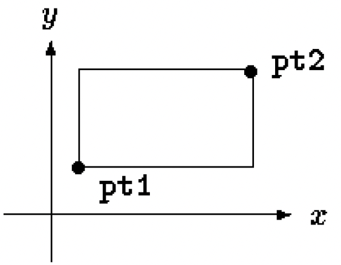

# User-Defined C Data Types

## Table of Contents
1. [Goals](#goals)
2. [C Structures](#c-structures)
3. [C Unions](#c-unions)

## Goals <a name="goals"></a>
Arrays, structures, and unions are all *user-defined data types*.
We have discussed arrays extensively in a previous [module](../c-pointers/notes.md#arrays).
While an array is a *homogeneous* collection 
(aggregating scalar data of the same type into a larger data type),
**structures** and **unions** are the two mechanisms for creating
**heterogeneous** collections
by *combining objects of different types*.
We will discuss these two data types in this module.

## C Structures <a name="c-structures"></a>
A structure is 
*a collection of one or more variables, possibly of different types, grouped together under a single name for convenient handling*.
Structures help to organize complicated data, 
because they permit *a group of related variables to be treated as a unit* 
instead of as separate entities. For example, 
```c
struct point {
    int x;
    int y;
};
```
The keyword `struct` introduces a structure declaration, 
which is a list of declarations enclosed in *braces*. 
An optional name called a *structure tag* may follow the word `struct` 
(as with `point` in the example above). 
The tag names this kind of structure,
and can be used subsequently as a shorthand for the part of the declaration in braces.
The variables named in a structure are called *members*.

<!-- A structure member or tag and an ordinary (i.e., non-member) variable 
can have the same name without conflict, 
since they can always be distinguished by context. 
Furthermore, the same member names may occur in different structures. -->

A `struct` declaration defines a type. 
The right brace that terminates the list of members may be followed by a list of variables, just as for any basic type:
```c
struct {...} x, y, z;
```
The statement declares `x`, `y` and `z` to be variables of the `struct` type 
and *causes space to be set aside for them*.
A structure declaration that is not followed by a list of variables reserves no storage.
If the declaration is *tagged*, the tag can be used later 
in definitions of instances of the structure. For example,
```c
struct point pt;
```
defines a variable `pt` which is a structure of type `struct point`.
A member of a particular structure is referred to 
in an expression by a construction of the form *structure_name.member*.
The *structure member operator* "`.`" connects the structure name and the member name.

Structures can be nested. For example, to represent a rectangle 
in a Cartesian coordinate system,
we can use the locations of two diagonally opposite corners:
```c
struct rect {
    struct point pt1;
    struct point pt2;
};
```


The only legal operations on a structure are 
copying it or assigning to it as a unit, 
taking its address with `&`, 
and accessing its members. 
Copy and assignment include passing arguments to functions 
and returning values from functions as well. 
Structures may not be compared. 
<!-- A structure may be initialized by a list of *constant member values*; 
an automatic structure may also be initialized by an *assignment*. -->
**Let's see some [code](code/structs.c).**
 In the example, we also introduce a new notation `->` to access
 a member in a structure from a **pointer to the structure**.

> To create *an array of structures*, here is an example:
> ```c
> struct key {
>     char *word;
>     int count;
> } keys[NKEYS];
> ```
> It declares a structure type `key` and defines an array called `keys`
> of structures of the `key` type. 
> It also sets aside storage for this array.
> Each element of this array is a structure.
> This is a shorthand for:
> ```c
> struct key {
>     char *word;
>     int count;
> };
> struct key keys[NKEYS];
> ```
>> The quantity `NKEYS` is the number of keys in `keys`.
>> We could compute it *at compile time*, 
>> since the size of the array is completely determined
>> at compile time.
>> To do so, we can use C's **compile-time unary operator**
>> `sizeof` (we have seen this [before](../c-pointers/notes.md#memory))
>> that can be used to compute the size of any object or any type in bytes.
>> An object can be a variable or array or structure. 
>> A type name can be the name of a basic type like `int` or `double`, 
>> or a derived type like a structure or a pointer.
>> In our example, we can do either one of the following:
>> ```c
>> #define NKEYS (sizeof keys / sizeof(struct key))
>> /* alternatively */
>> #define NKEYS (sizeof keys / sizeof(keys[0]))
>> ```

<!-- The structure initialization is analogous to earlier ones - 
the definition is followed by a list of initializers enclosed in braces: 
struct key {
    char *word;
    int count;
} keytab[] = {
    "auto", 0,
    "break", 0,
    "case", 0,
    "char", 0,
    "const", 0,
    "continue", 0,
    "default", 0,
    /* ... */
    "unsigned", 0,
    "void", 0,
    "volatile", 0,
    "while", 0
};
The initializers are listed in pairs corresponding to the structure members. 
It would be more precise to enclose the initializers for each "row" or structure in braces:
    { "auto", 0 },
    { "break", 0 },
    { "case", 0 },
    ...
but inner braces are not necessary when the initializers are simple variables 
or character strings, and when all are present. 
As usual, the number of entries in the array keys will be computed 
if the initializers are present and the [] is left empty. -->

<details>
<summary>:heavy_plus_sign: Good To Know</summary>

As mentioned in a previous [module](../c-pointers/notes.md#memory),
objects have **alignment**, 
which restricts where they can be stored in memory. 
For instance, on x86-64 machines, `int` has alignment 4.
This means that the address of any `int` in the program is *always* a multiple of 4,
whether it is located on the stack (automatic lifetime), 
the data segment (static lifetime), 
or the heap (dynamic lifetime).

*Alignment restrictions* for an x86-64 machine are listed in the table below.
| Data Types | Size | Address Restriction |
|------------|------| --------------------|
| `char`     | 1    | No restriction      |
| `short`    | 2    | Multiple of 2       |
| `int`      | 4    | Multiple of 4       |
| `long`     | 8    | Multiple of 8       |
| `float`    | 4    | Multiple of 4       |
| `double`   | 8    | Multiple of 8       |
| `T*`       | 8    | Multiple of 8       |

The compiler's `__alignof__` special form 
returns a type or object's alignment. 
On x86-64 Linux, `__alignof__(T) == sizeof(T)` for all *fundamental types* 
(i.e., the types built in to C: integer types, floating point types, and pointers). 
This is not always true: on x86-32 Linux, `double` has size 8 but alignment 4.
However, *an object's size is always a multiple of its alignment*.

*The offset of any struct member — which is the difference between the address of the member and the address of the containing struct — is a multiple of the member's alignment.*

**Do not assume that the size of a structure is the sum of the sizes of its members.**
Because of *alignment requirements* for different objects, 
there may be unnamed "holes" (padding) in a structure. 
Thus, for instance, if a `char` is one byte and an `int` four bytes, the structure
```c
struct {
    char c;
    int i;
};
```
might well require *eight* bytes, not five. 
The `sizeof` operator returns the proper value.

<!-- Reference: https://cs61.seas.harvard.edu/wiki/2017/Datarep3 -->
</details>

C provides a facility called `typedef` for creating new data type names.
For example,
```c
typedef struct point {
    int x;
    int y;
} Point;
```
This creates a new type keyword called `Point` (a structure),
which becomes a synonym for `struct point`.
For example, instead of
```c
sizeof(struct point)
```
You can do
```c
sizeof(Point)
```
We typically use capitalized names for `typedef`s, to make them stand out.
It must be emphasized that a `typedef` declaration does *not* create a new type in any sense; 
it merely adds a *new name* for some existing type. 
Nor are there any new semantics: variables declared this way have exactly the same properties 
as variables whose declarations are spelled out explicitly.
> Besides purely aesthetic issues, there are two main reasons for using `typedef`s:
> * *Parameterize a program against portability problems*:
> If `typedef`s are used for data types that may be machine-dependent, 
> only the `typedef`s need change when the program is moved (e.g., `size_t` and `ptrdiff_t` are implemented using `typedef`s).
> * *Provide better documentation for a program*:
> a customized type name may be easier to understand 
> than one declared only as e.g., a complicated structure.

## C Unions <a name="c-unions"></a>
A **union** is a variable that may hold (at different times) *objects of different types and sizes*,
with the compiler keeping track of size and alignment requirements. 
Unions provide a way to manipulate different kinds of data 
in a single area of storage.
The syntax is identical to structures.
For example,
```c
union u_tag {
    int ival;
    float fval;
    char *sval;
} u;
```
The variable `u` will be *large enough to hold the largest of the three types*.
Any of these types may be assigned to `u` and then used in expressions, 
so long as *the usage is consistent*: 
**the type retrieved must be the type most recently stored**. 
It is the programmer's responsibility to keep track of 
which type is currently stored in a union.
Syntactically, members of a union are accessed as _union-name.member_
or _union-pointer->member_
(identical notation to `struct`s).
For example:
```c
struct {
    char *name;
    int flags;
    int utype;
    union {
        int ival;
        float fval;
        char *sval;
    } u;
} symtab[NSYM];
```
We can access the member `ival` by:
```c
symtab[i].u.ival
```
The same operations are permitted on unions as on structures:
assignment to or copying as a unit, taking the address, and accessing a member.
**A union may only be initialized with a value of the type of its first member**; thus union `u`
in the example above can only be initialized with an integer value.

<!-- Will not cover bit-fields 
A bit-field, or field for short, 
is a set of adjacent bits within a single implementation-defined storage unit 
that we will call a ``word.'' For example,
```c
struct {
    unsigned int is_keyword : 1;
    unsigned int is_extern : 1;
    unsigned int is_static : 1;
} flags;
```
This defines a variable table called `flags` that contains three 1-bit fields.
The number following the colon represents the field width in bits. 
The fields are declared `unsigned int` to ensure that they are unsigned quantities.

Individual fields are referenced in the same way as other structure members:
flags.is_keyword, flags.is_extern, etc.
Fields behave like small integers, and may participate in arithmetic expressions just like other integers.
For example,
```c
flags.is_extern = flags.is_static = 1;
```
to turn the bits on;
```c
flags.is_extern = flags.is_static = 0;
```
to turn them off; and
```c
if (flags.is_extern == 0 && flags.is_static == 0)
    ...
```
to test them.

Fields may be declared only as ints; 
for portability, specify `signed` or `unsigned` explicitly. 
They are *not* arrays and they do not have addresses, so the `&` operator cannot be applied on them.
-->
